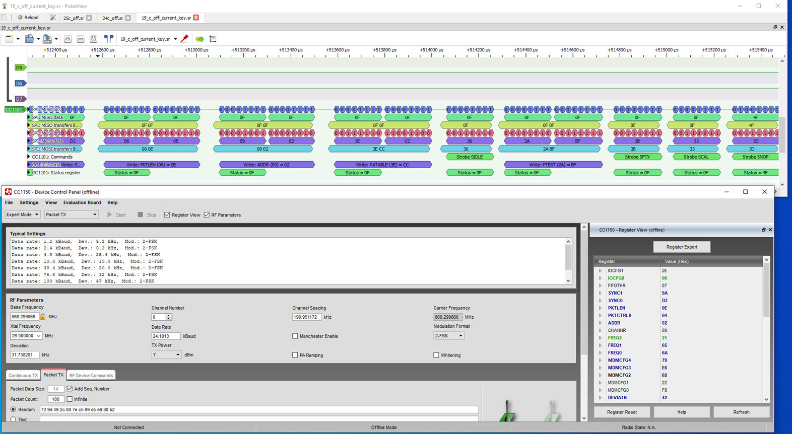
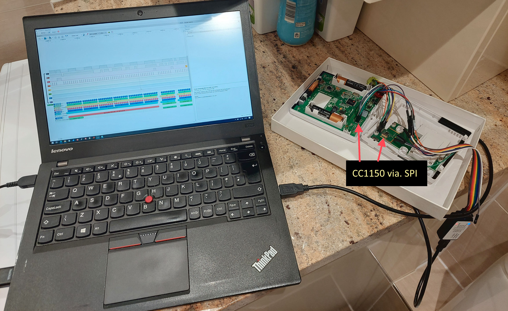
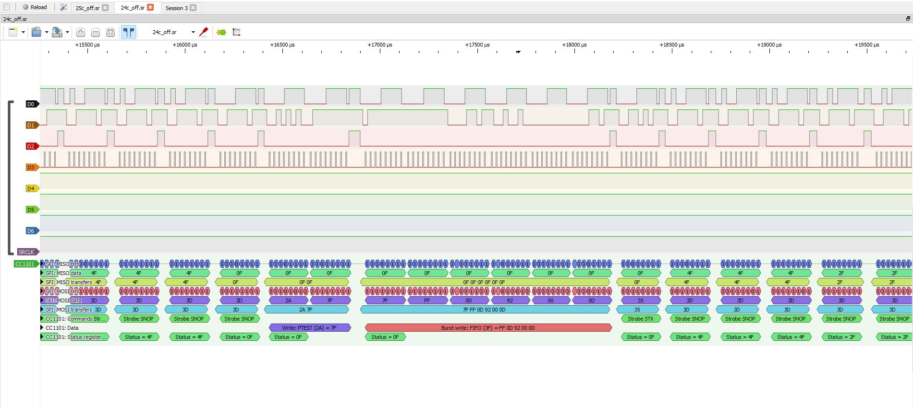

# Salus ST621RF(TX)

A popular heating controller from the early 2010's. Uses an unknown Samsung MCU (I don't care about this), but uses a CC1150 on a seperate daughterboard (the back panel) to communicate to the heater.

Interception with a logic level analyser reveals it is using standard SPI to communicate to the CC1150 transmitter.

SummarY:

* It's easy to turn the heating off any off via. replay attack. 
* Pairing between the Salus thermometor to the heater simply changes some random values in the messages that are sent to the heater. I wasn't bothered to try and reverse engineer this.
* All one needs to do is use the same ChipCon config with say a CC1101, capture a sent messages for both turning ON the heating and OFF, and then replay these when one wants to turn the heating on or off.
* The payload sent over the air to the heater is simply akin to 'turn on heating' and 'turn off heating', and the temperature is irrelevant. All the boiler gets told is to be ON or OFF.

** RF Settings **

From SPI interception, the ChipCon configuration register values for the CC1150 are as follows:

```
//
// Rf settings for CC1150
//
halRfWriteReg(IOCFG0,0x06);  //GDO0 output pin configuration (for customer data s..
halRfWriteReg(SYNC1,0x9A);   //Sync word, high byte
halRfWriteReg(SYNC0,0xD3);   //Sync word, low byte
halRfWriteReg(PKTLEN,0x0E);  //Packet length
halRfWriteReg(PKTCTRL0,0x05);//Packet automation control
halRfWriteReg(ADDR,0x02);    //Device address
halRfWriteReg(FREQ2,0x21);   //Frequency control word, high byte
halRfWriteReg(FREQ1,0x65);   //Frequency control word, middle byte
halRfWriteReg(FREQ0,0x6A);   //Frequency control word, low byte
halRfWriteReg(MDMCFG4,0x79); //Modulator configuration
halRfWriteReg(MDMCFG3,0xE6); //Modulator configuration
halRfWriteReg(MDMCFG2,0x03); //Modulator configuration
halRfWriteReg(DEVIATN,0x42); //Modulator deviation setting
halRfWriteReg(MCSM0,0x18);   //Main Radio Control State Machine configuration
halRfWriteReg(FSCAL3,0xE9);  //Frequency synthesizer calibration
halRfWriteReg(FSCAL2,0x2A);  //Frequency synthesizer calibration
halRfWriteReg(FSCAL1,0x00);  //Frequency synthesizer calibration
halRfWriteReg(FSCAL0,0x1F);  //Frequency synthesizer calibration
halRfWriteReg(FSTEST,0x59);  //Frequency synthesizer calibration control
halRfWriteReg(TEST2,0x00);   //Various test settings
halRfWriteReg(TEST1,0x21);   //Various test settings
halRfWriteReg(TEST0,0x09);   //Various test settings
```

Register values extracted from SPI inteception were fed into SmartRF Studio to see what they mean in practical terms.




These could be used with a CC1101 that supports the right frequency band. In my case the CC1150 communicated on 868Mhz.

Salus ST621RF(TX) - Inspecting the data transmitted over the air to turn the heating on and off.
https://support.salus-tech.com/portal/en/kb/articles/st620-series-thermostat-manuals

** RF Payload Data Interception **

Values are different every time one pairs a controller to their boiler, but as stated above. These are those captured from my analysis, patterns can be noted.


```
When pairing:

1st pairing message:
7F FF 01 44 DD 0F

2nd pairing message:
7F 11 44 DD 04 28 09 1C 2A 00 00 1C 00 32 FB

(this repeats forever until user ends paring if a success)


------------------

Turn heating ON @ 32 degrees (room temp was 21 degrees or so):

pulse 1: 7F FF 01 44 DD 0B

pulse 2: 7F 11 44 DD 20 28 09 1C 2A 00 00 40 00 32 3B

pulse 3: 7F FF 01 44 DD 0B

pulse 4: 7F 11 44 DD 20 28 09 1C 2A 00 00 40 00 32 3B


Turn heating OFF @ 19 degrees (room temp was 21 degrees or so):

pulse 1: 7F FF 01 44 DD 0D

pulse 2: 7F 11 44 DD 00 3E 09 1C 2A 00 00 27 00 32 18

pulse 3: 7F FF 01 44 DD 0D

pulse 4: 7F 11 44 DD 00 3E 09 1C 2A 00 00 27 00 32 18
         7F 11 44 DD 00 3E 09 1C 2A 00 00 26 00 32 17 (second attempt turning off)
  	     7F 11 44 DD 00 33 09 1C 2A 00 00 26 00 32 0C (third) 
         7F 11 44 DD 00 3E 09 1C 2A 00 00 26 00 32 17 (forth)
		 
		 
		 
Comparing ON and Off Message:

ON:  7F 11 44 DD 20 28 09 1C 2A 00 00 40 00 32 3B
OFF: 7F 11 44 DD 00 3E 09 1C 2A 00 00 27 00 32 18

A few bytes are different, most are the same, but I have no idea why.

```

** Make you're own controller **

At minimum, you'd need a MCU (like the ESP32) and a CC1101 868Mhz.

Could go all-out and also have:

OPEN-SMART With Backlight LED 3.3V 1.8 Inch 128 * 64 Serial SPI Monochrome LCD Shield Breakout Board Module for Arduino
https://www.aliexpress.com/item/33061199153.html?spm=a2g0o.cart.0.0.a4d838dadmigBI&mp=1

TZT Mini 1.8V 3V 3.7V 5V to 3.3V Boost & Buck Low Noise Regulated Charge Pump 2 in 1 DC/DC Converter
https://www.aliexpress.com/item/1005006407404828.html?spm=a2g0o.cart.0.0.a4d838dadmigBI&mp=1

CC1101 Wireless Module Long Distance Transmission Antenna 868MHZ SPI Interface Low Power M115 For FSK GFSK ASK OOK MSK 64-byte
https://www.aliexpress.com/item/1005005985514088.html?spm=a2g0o.cart.0.0.a4d838dadmigBI&mp=1

5X7CM Double Side Prototype PCB Breadboard Universal Board ForArduino ForUNO R3 ESP8266 WIFI ESP-12F ESP-12E ESP32S ESP3250x70mm
https://www.aliexpress.com/item/32845616421.html?spm=a2g0o.cart.0.0.a4d838dadmigBI&mp=1

ChengHaoRan 1piece 1.27mm 2.0mm 2.54mm Pitch Transfer Plate Converter Single Double Row Pin PCB PCI Adapter Board
https://www.aliexpress.com/item/1005005337667319.html?spm=a2g0o.cart.0.0.a4d838dadmigBI&mp=1

20PCS Tactile Push Button Switch Momentary 12*12*7.3MM Micro switch button with knob Yellow Green Red Kit 12x12x7.3
https://www.aliexpress.com/item/1005005315348507.html?spm=a2g0o.cart.0.0.a4d838dadmigBI&mp=1

1pc Waterproof Black/white Housing Instrument Case ABS Plastic Project Box Storage Case Enclosure Boxes Electronic Supplies
https://www.aliexpress.com/item/1005005467340473.html?spm=a2g0o.cart.0.0.a4d838dadmigBI&mp=1

** Images ***





